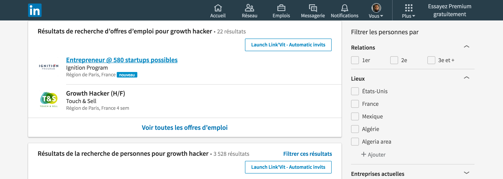
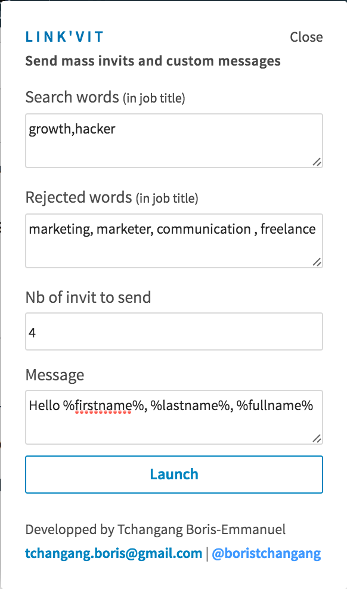

# LinkVit 
LinkVit - mass invits and messages on Linkedin

## Download
Download on chrome store here :

## Description (see screenshots below)
Link'Vit helps you to get more contacts. Make a search and send mass invitations with customs messages within minutes.  
This extension started on growth hacking forum : https://www.growthhacking.fr/t/comment-avoir-73-d-engagement-sur-un-mass-follow-linkedin/9004/26

## How it works ?
Make a search on Linkedin. LinkVit will detect "add" button. We add a button the result page to launch LinkVit.  
Then you will have a popup with informations to fill like "search term" (add people who have only this field in their jobtitle), "rejected term" and message.

## Download
Download Link'Vit on chrome webstore. 

## Custom message
You can send custom messages with %firstname%, %lastname% and %fullname%.   
Exemple : Hello %firstname%, I'm Boris. I like your project and I think my tools can help you get more clients.  
Exemple 2 : Hello Mr %firstname% %lastname%, I'm Boris. I like your project and I think my tools can help you get more clients.  
Exemple 3 : Hello Mr %fullname%, I'm Boris. I like your project and I think my tools can help you get more clients.

## Errors, Bugs, suggestions
Feel free to contact me at tchangang.boris@gmail.com

##Screenshots

  

