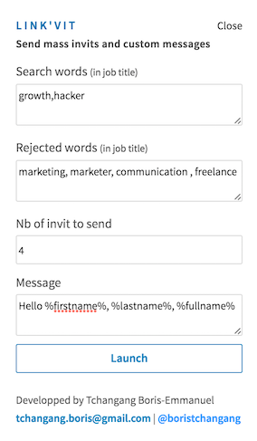

 
# LinkVit 
LinkVit - Manage your connection like never : mass invits with custom messages and auto delete old connections on Linkedin

## Download
Download on chrome store here : https://chrome.google.com/webstore/detail/linkvit-mass-invits-and-m/lphfogbcapkfkfkdboppgihnfbelkdbn

## Description (see screenshots below)
Link'Vit helps you to get more contacts. Make a search and send mass invitations with customs messages within minutes.  
<b>New : You can now remove invitations older than 'your criteria' days</b>

This extension started on growth hacking forum : https://www.growthhacking.fr/t/comment-avoir-73-d-engagement-sur-un-mass-follow-linkedin/9004/26

## Mass contacts on Linkedin
Make a search on Linkedin. LinkVit will detect "add" button. We add a button the result page to launch LinkVit.  
Then you will have a popup with informations to fill like "search term" (add people who have only this field in their jobtitle), "rejected term" and message.

The extension uses random interval to fake a human. Don't worry.

## Delete old invitations
Open the page : https://www.linkedin.com/mynetwork/invitation-manager/sent/.

Linkvit will add a button at the top of page "Link'vit - Remove old invits". Click and specify your criteria (in days). By exemple, entering 2 will remove invitations older than 2 peoples. 

The extension uses random interval to fake a human. Don't worry.

## Download
Download Link'Vit on chrome webstore. 

## Support
If you like it, please give us a rate on chrome web store here : https://chrome.google.com/webstore/detail/linkvit-mass-invits-and-m/lphfogbcapkfkfkdboppgihnfbelkdbn

## Custom message
You can send custom messages with %firstname%, %lastname% and %fullname%.   
Exemple : Hello %firstname%, I'm Boris. I like your project and I think my tools can help you get more clients.  
Exemple 2 : Hello Mr %firstname% %lastname%, I'm Boris. I like your project and I think my tools can help you get more clients.  
Exemple 3 : Hello Mr %fullname%, I'm Boris. I like your project and I think my tools can help you get more clients.

## Errors, Bugs, suggestions
Feel free to contact me at tchangang.boris@gmail.com

##Screenshots

  

